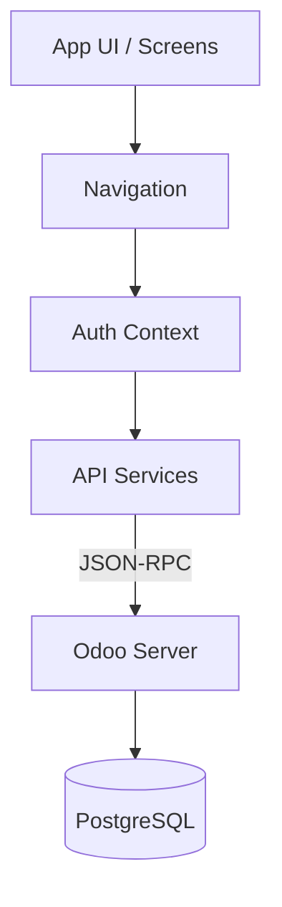

# 📱 Odoo Attendance App (React Native)


> **Una solución móvil profesional para la gestión de asistencia de empleados, conectada en tiempo real con tu ERP Odoo.**

Esta aplicación permite a los empleados registrar sus entradas y salidas, visualizar su historial y mantener un control de sus horas trabajadas, todo sincronizado directamente con el módulo `hr.attendance` de Odoo.

---

## 📑 Tabla de Contenidos

- [✨ Características](#-características)
- [🛠️ Stack Tecnológico](#-stack-tecnológico)
- [🏗️ Arquitectura](#-arquitectura)
- [📱 Capturas de Pantalla](#-capturas-de-pantalla)
- [📂 Estructura del Proyecto](#-estructura-del-proyecto)
- [🚀 Guía de Instalación](#-guía-de-instalación)
- [⚙️ Configuración](#-configuración)
- [🐛 Solución de Problemas](#-solución-de-problemas)
- [📄 Licencia](#-licencia)

---

## ✨ Características

✅ **Autenticación Segura**: Login directo contra la base de datos de usuarios de Odoo.
✅ **Check-in / Check-out Rápido**: Registro de asistencia con un solo toque.
✅ **Estado en Tiempo Real**: Visualización inmediata del estado actual (Entrada/Salida).
✅ **Cálculo de Horas**: Contador de tiempo transcurrido durante la jornada activa.
✅ **Historial Detallado**: Lista de asistencias pasadas con fechas y duraciones.
✅ **Resumen Semanal**: Gráfico o resumen de horas acumuladas en la semana.
✅ **Persistencia de Sesión**: Mantiene al usuario logueado usando almacenamiento seguro.

---

## 🛠️ Stack Tecnológico

La aplicación ha sido construida utilizando las últimas tecnologías y mejores prácticas:

### Frontend (Móvil)
*   **Framework**: [React Native](https://reactnative.dev/)
*   **Plataforma**: [Expo](https://expo.dev/) (Managed Workflow)
*   **Navegación**: React Navigation v6 (Native Stack)
*   **Estilos**: StyleSheet API con sistema de diseño personalizado
*   **Almacenamiento**: `expo-secure-store` para tokens y credenciales

### Backend (ERP)
*   **Core**: Odoo Community o Enterprise (versiones 14, 15, 16, 17)
*   **Módulo Requerido**: `hr_attendance` (Asistencias)
*   **Comunicación**: JSON-RPC sobre HTTP/HTTPS

---

## 🏗️ Arquitectura

La aplicación sigue una arquitectura limpia y modular:



*   **Context API**: Gestiona el estado global de la sesión del usuario.
*   **Services Layer**: Separa la lógica de negocio y las llamadas a la API de la interfaz de usuario.
*   **Adapters**: Transforman los datos de Odoo a un formato amigable para la App.

---


---

## 📂 Estructura del Proyecto

Organización lógica para facilitar la escalabilidad:

```bash
rn6/
├── assets/                 # Recursos estáticos (imágenes, fuentes)
├── odoo-addons/            # (Opcional) Addons personalizados para el servidor
├── odoo-config/            # Configuración de Docker para Odoo
├── src/
│   ├── context/            # Estado global (AuthContext.js)
│   ├── navigation/         # Configuración de rutas (AppNavigator.js)
│   ├── screens/            # Pantallas (Login, Home, History)
│   ├── services/           # Comunicación con API (odooApi.js, attendanceService.js)
│   ├── styles/             # Variables de diseño y temas (theme.js)
│   └── utils/              # Funciones auxiliares (dateFormatter.js)
├── App.js                  # Punto de entrada de la aplicación
├── docker-compose.yml      # Entorno de desarrollo local
└── app.json                # Configuración de Expo
```

---

## 🚀 Guía de Instalación

Sigue estos pasos para obtener una copia local funcionando en minutos.

### 1️⃣ Prerrequisitos

*   **Node.js**: v18.0.0 o superior.
*   **npm** o **yarn**.
*   **Expo Go**: Instalado en tu móvil (Android/iOS) para pruebas físicas.
*   Alternativamente, Android Studio / Xcode para simuladores.

### 2️⃣ Clonar el Repositorio

```bash
git clone https://github.com/TU_USUARIO/TU_REPO.git
cd rn6
```

### 3️⃣ Instalar Dependencias

```bash
npm install
# O si usas yarn
yarn install
```

### 4️⃣ Configurar el Backend (Odoo)

Si no tienes un servidor Odoo, puedes levantar uno localmente con Docker utilizando la configuración incluida en este proyecto (`docker-compose.yml`).

1. **Levantar los servicios:**
   ```bash
   docker-compose up -d
   ```

2. **Acceder a Odoo:**
   *   Abre tu navegador en `http://localhost:8069`.
   *   Utiliza la **Master Password**: `admin123` (definida en `odoo-config/odoo.conf`).
   *   Crea una nueva base de datos (ej. `odoo_attendance`).
   *   **Email**: `admin` / **Password**: `admin`.

3. **Instalar el módulo de Asistencias:**
   *   Ve al menú de "Aplicaciones".
   *   Busca "Attendance" (o Asistencias) e instálalo.
   *   Ve a "Empleados" y crea un nuevo empleado.
   *   **Importante**: En la pestaña "Configuración RRHH" del empleado, asegúrate de crearle un "Usuario Relacionado" para que pueda hacer login desde la App.

### 5️⃣ Ejecutar la Aplicación

```bash
npx expo start
```

*   Escanea el código QR con la app **Expo Go**.
*   O presiona `a` para abrir en emulador Android.
*   O presiona `i` para abrir en simulador iOS.

---

## ⚙️ Configuración

### Credenciales de Acceso (Demo)

El entorno ha sido pre-configurado con los siguientes datos de acceso:

| Campo | Valor | Notas |
| :--- | :--- | :--- |
| **URL del Servidor** | `http://<TU_IP_LOCAL>:8069` | ⚠️ Usa tu IP local (ej. `192.168.1.XX`) si pruebas desde el móvil. |
| **Base de Datos** | `odoo_attendance` | Base de datos creada automáticamente. |
| **Email / Usuario** | `demo@empresa.com` | Usuario empleado demo. |
| **Contraseña** | `demo123` | Contraseña del usuario demo. |

> **Panel de Administración**: Para acceder al backend de Odoo como administrador, usa `admin` / `admin`.

---

## 🐛 Solución de Problemas

**Error: "Network Request Failed"**
*   Asegúrate de que el móvil y el PC estén en la misma red WiFi.
*   Revisa que el firewall de Windows/Mac no esté bloqueando el puerto 8069.
*   Usa la IP numérica de tu PC (ej. `192.168.x.x`), no `localhost`.

**Error: "Access Denied"**
*   Verifica que el usuario tenga permisos de acceso en Odoo.
*   Asegúrate de que la base de datos sea la correcta.

---

## 📄 Licencia

Este proyecto está bajo la Licencia MIT. Consulta el archivo `LICENSE` para más detalles.

---

<p align="center">
  Hecho con ❤️ y React Native
</p>
